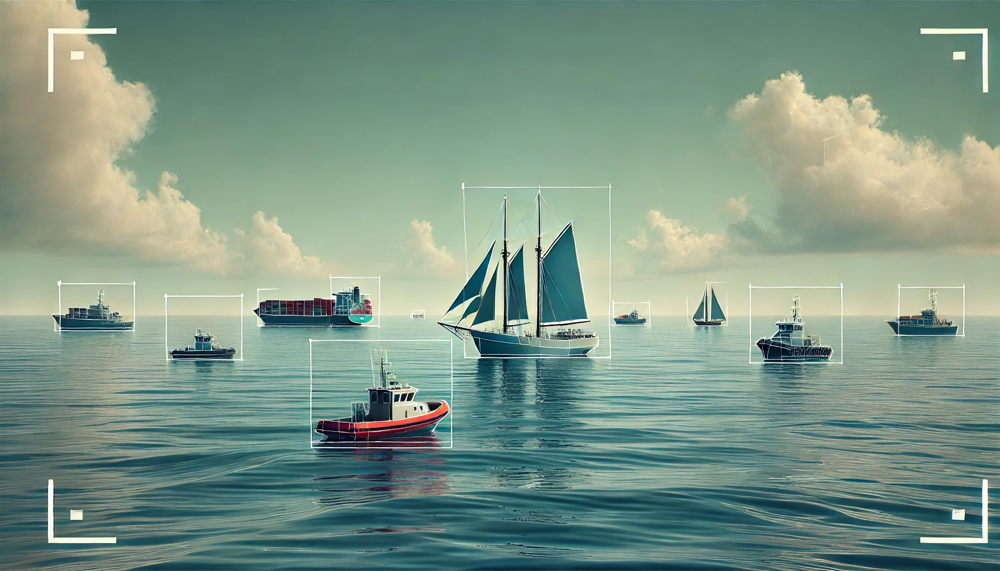

<div align='center'>
    <h1><b> Classification vidéo d'objets marins par intelligence artificielle  </b></h1>
    


</div>

# Introduction

# Implémentation du modele de classification
## Installation Yolov9 :

Clone du repo Yolov9 :
```shell
git clone https://github.com/WongKinYiu/yolov9.git
cd yolov9
pip install -r requirements.txt -q
```
Comprend le modèle, les premiers poids, tous les outils d'analyse des résultats d'entrainements ect ...

Les fichiers .pt sont des modèles "pré-entraînés" : des fichiers qui contiennent un modèle qui a déjà appris à faire de la reconnaissance d'objets.  
Plusieurs versions sont dispo, adaptées à différentes situations :

* Rapide mais moins précis → Tiny (...-t).
* Equilibré → Small ou Medium (...-s / ...-m).
* Précis mais énergivore → Custom ou Enhanced (...-c / ...-e).

Pour la demo on prendra le fichier gelan-c-det.pt (techno Gelan, Custom et adapté à la détection d'objets).  
On les place dans un nouveau fichier "weights" dans le dossier Yolov9 :

```shell
mkdir -p yolov9/weights
wget -P yolov9/weights -q https://github.com/WongKinYiu/yolov9/releases/download/v0.1/gelan-c-det.pt
```

## Installation Datasets :

J'ai ici utilisé Roboflow Universe, une plateforme qui regroupe une communauté de plus de 200 000 ensembles de données de vision par ordinateur.  

Apres avoir choisi un dataset sur Roboflow, plusieurs options s'offrent à nous :
- Format zip
- Terminal
- Code Jupiter_Notebook (que j'ai choisi et dont le script est dans : [Datasets_download.ipynb](yolov9%2FDatasets_download.ipynb))

Une identification sera demander lors de l'execution du code, il suffit dans le cas où vous avez un compte de copier 
le lien sur lequel vous êtes envoyé dans le terminal et sinon de créer un compte sur roboflow.

Lors du choix d'un dataset vérifier que :

 * Les données sont représentatives de la réalité. Si le dataset est déséquilibré (par exemple, sur-représentation d'une classe), le modèle risque de ne pas généraliser correctement.
(cas que j'ai rencontré avec les datasets SMD et MODD qui sur-représentaient les cargos pas vrm présent dans le bassin d'Arcachon ...)


 * Plus un modèle est complexe, plus il a besoin de données pour apprendre efficacement. Cependant, avoir trop de données peut entraîner des temps de traitement excessifs ou des difficultés d'analyse.

**Les datasets sont à installer dans le repertoire yolov9 !**

## Training :

Pour la demo un petit dataset simple mais efficace sera utilisé. 
Il est important de bien choisir/trouver son dataset, cela a été la principale difficulté de ce projet !

Voilà la commande de base d'un simple entrainement les differents parametres sont dans le code train.py et sont à adapter suivant les besoins.

```shell
cd yolov9
python train.py \
--batch-size 8 \
--epochs 50 \
--img 640 \
--device 0 \
--data "Sea-Vessels-Dataset-2/data.yaml" \
--weights "weights/gelan-c-det.pt" \
--cfg "models/detect/gelan-c.yaml" \
--hyp "data/hyps/hyp.scratch-high.yaml" 
```

## Detection :

Le script suivant est le lancement du code detect.py classique dans la console :
```shell
cd yolov9
python detect.py \
--img 1280 \
--conf 0.5 \
--device 0 \
--weights "runs/train/exp/weights/best.pt" \
--source "videos/Exemple_port.mp4" \
--view-img \
--nosave 
```

# Application sur un flux vidéo en direct : cameras IP (via RTSP)

Une fois le modèle établit l'objectif était d'appliquer celui-ci à des caméras IP.
Pour récupérer le flux vidéo des caméras on utilisera le protocole RTSP (Real-Time Streaming Protocol).

Pour ce faire le script detect.py (utilisé pour "appliquer" le modele de classification a une image/video) à été modifié affin de pouvoir s'appliquer à un flux vidéo live comme le RTSP.  
L'option ```camera_urls``` a donc été introduite pour permettre le traitement des flux vidéo provenant d'URL (comme des caméras IP).

```python
def run(weights=ROOT / 'yolo.pt', source=ROOT / 'data/images', camera_urls=None, ...):
    if camera_urls:
        source = camera_urls[0]
    else:
        source = str(source)
    ...
```
Voir [Rapport_ProjetMagellan_RTSP_CODEC.pdf](Ressources_Rapports/Rapport_ProjetMagellan_RTSP_CODEC.pdf), pour quelques infos supplémentaires.

# Affichage

Pour l'affichage 2 méthodes ont été pensées :
* **Interface Web :** Une plutôt pour la comparaison et l'étude de résultats des entrainements. 
* **Environnement Virtuel :** L'autre plutôt pour l'immersion dans le point de vue du drone (affin de mieux observer les alentours voir d'envisager de le piloter).

## Mini Interface Web : Streamlit

L'objectif est d'avoir un apercu clair de ce qui est ou a été réalisé.
L'interface comprend différents curseurs/boutons afin de régler :
* Le **modèle** à utiliser.
* Le **média** sur lequel lancer la détection.
* La valeur du **seuil de confiance** (filtre les détections en fonction du niveau de confiance attribué à chaque prédiction).
* S'il faut ou non **enregistrer** les résultats
* L'affichage des **performances**

## Réalité virtuelle : Unity


# Bugs rencontrés

**Terminal utilisé : WSL**  
Install : Windows Powershell admin =>  ```wsl --install```.  
Pour l'utiliser sur Pycharm : ```Ctrl + Alt + S``` => ```Tools``` => ```Terminal``` => ```Shell path : wsl.exe```

--------------------------------------------------------------

**Méthode getsize() deprecated dans Pillow**  
```AttributeError: 'FreeTypeFont' object has no attribute 'getsize'```  
La méthode getsize() utilisée dans le module utils/plots.py, est dépréciée dans les versions récentes de Pillow.  
Elle était utilisée pour obtenir la taille d'un texte (largeur et hauteur) dans le cadre de l'annotation des images.  
Elle a été remplacée par getbbox() qui renvoie la boîte englobante du texte.
```python
# Ancien code :
w, h = self.font.getsize(label)  # text width, height

# Nouveau code :
bbox = self.font.getbbox(label)  # text bounding box
w, h = bbox[2] - bbox[0], bbox[3] - bbox[1]  # width = x2 - x1, height = y2 - y1
```
La méthode getbbox() renvoie les coordonnées de la boîte englobante sous la forme (x1, y1, x2, y2).  
Pour obtenir la largeur et la hauteur du texte, nous calculons la différence entre les coordonnées x2 et x1 (largeur), et y2 et y1 (hauteur).

--------------------------------------------------------------

**torch.cuda.amp.GradScaler() and torch.cuda.amp.autocast() deprecated**  
```torch.cuda.amp.GradScaler(args...) is deprecated. Please use torch.amp.GradScaler('cuda', args...) instead.```
```torch.cuda.amp.autocast(args...) is deprecated. Please use torch.amp.autocast('cuda', args...) instead.```
PyTorch a déplacé certaines fonctionnalités dans un nouveau namespace torch.amp pour une meilleure gestion du calcul en précision mixte (AMP).  
Ce correctif assure la compatibilité avec les versions récentes de PyTorch.
```python
# Ancien code :
scaler = torch.cuda.amp.GradScaler(enabled=amp)
# Nouveau code :
scaler = torch.amp.GradScaler(enabled=amp)
...
# Ancien code :
with torch.cuda.amp.autocast(amp):

# Nouveau code :
with torch.amp.autocast('cuda', enabled=amp):
```

```shell
git add .
now = `date`
git commit -m "Update du $now"
git push origin main
```
